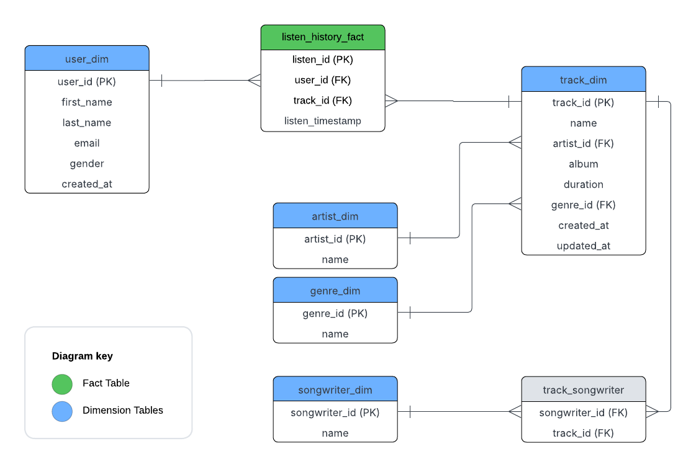
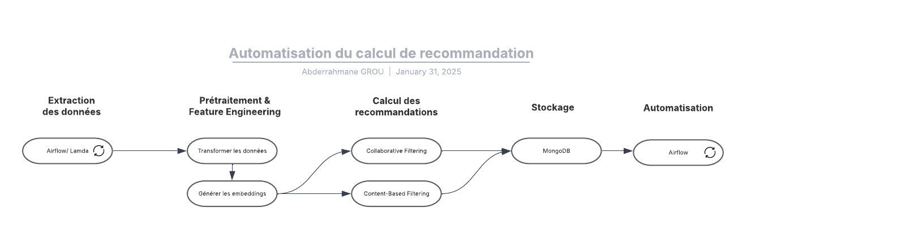
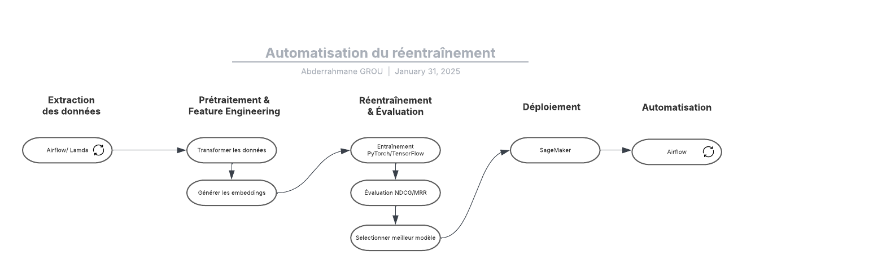

# Réponses du test

## _Utilisation de la solution (étape 1 à 3)_

### Étape 1: Création et activation de l'environnement virtuel.

1. Créer l'environnement virtuel (je l'ai nommé `moovai-test-env`) en exécutant la commande:

    ```python -m venv moovai-test-env```

2. Activer l'environnement selon votre système d'exploitation (J'ai utilisé l'environnement Windows pour la resolution du test):

    **Windows**: ``.\moovai-test-env\Scripts\activate``

    **Linux/MacOS**: ``source moovai-test-env/bin/activate``

3. Installer la liste des dépendences:

    ```pip install -r requirements.txt```

### Étape 2: Élaboration du flux de données.
Voici les étapes à suivre pour élaborer le flux de données:
 
1. Lancer le serveur **FastAPI**:
    - Accéder au dossier `src/moovitamix_fastapi` (commande `cd src/moovitamix_fastapi`).
    - Exécuter la commande `python -m uvicorn main:app`

2. Lancer le flux de données **DailyIngestionPipeline**:

    - Accéder au dossier `src/data_pipelines` (commande `cd src/data_pipelines`).
    - Exécuter la commande `python daily_ingestion_pipeline.py`.

3. Automatiser l'exécution du script:

    Pour automatiser la récupération des données quotidiennement, on peut utiliser des planificateurs locales:

    - **Windows**: Le programme `Task Scheduler`

    - **Linux/MacOS**: Le programme `cron`

    On peut également utiliser les services cloud:

    - **Amazon**: Configurer une fonction Lambda avec CloudWatch

    - **Google**: Configurer une fonction Cloud Functions avec Cloud Scheduler

### Étape 3: Tests.
J'ai implémenter 5 tests essentiels pour verifier le fonctionnement du flux de données:

1. `test_fetch_data_success`: 
    Valide la gestion de la pagination et la collecte complète des données.

2. `test_fetch_data_error_handling`: 
    Assure la résilience du pipeline en cas de défaillance de l'API

3. `test_directory_creation`: 
    Confirme l’organisation correcte des données (structure des dossiers).

4. `test_save_to_csv_special_handling`: 
    Vérifie la gestion correcte des types de données complexes (liste d'éléments listen_history).

5. `test_empty_data_handling`: 
    Assure une gestion élégante des cas limites (edge cases).

## Questions (étapes 4 à 7)

### Étape 4: Schéma de la base de données

Étant donné que nous allons stocker les données pour faire des analyses avancées et alimenter notre système de recommendation, j'ai décidé d'adopter l'approche hybride:
- Le modèle relationnel (Data Warehouse avec PostegreSQL ou Snowflake) pour le stockage structuré des dimensions et des faits.
- Le modèle non relationnel (Data Lake avec MongoDB): pour stocker rapidement les événements d'écoute et les recommandations (les embeddings des chansons sont gérées plus efficacement avec les fichiers json).

J'ai conçu le schéma de l'entrepot de données sous forme d'un snowflake schema avec 1 table de faits et 5 tables de dimensions. J'ai choisi de le rendre trop normalisé pour gagner en flexibilité sur la mise à l'échelle et l'optimisation, puisque l'objectif est d'optimiser notre système de recommandation et aussi pour l'analyse future des données.

Le schéma de la base de donnée sera de la forme suivante:

| listen_history_fact | user_dim     | track_dim     | artist_dim    | genre_dim    | songwriter_dim    |
| ------------------- | ------------ | ------------- | ------------- | ------------ | ----------------- |
| listen_id (PK)      | user_id (PK) | track_id(PK)  | artist_id (PK)| genre_id (PK)| songwriter_id (PK)|
| user_id (FK)        | first_name   | name          | name          | name         | name              |
| track_id (FK)       | last_name    | artist_id(FK) |               |              |                   |
| listen_timestamp    | email        | album         |               |              |                   |
|                     | gender       | duration      |               |              |                   |
|                     | created_at   | genre_id (FK) |               |              |                   |
|                     |              | created_at    |               |              |                   |
|                     |              | updated_at    |               |              |                   |

[](step_4.png)

### Étape 5: Surveillance et santé de la pipeline.

Pour assurer une bonne surveillance de la santé du pipeline, on peut implémenter des logs, des alertes des métriques clés.

1. **Afficher les logs**:

    Dans mon code actuel `daily_ingestion_pipeline.py`, j'ai déjà implémenté l'affichage des logs avec l'outil python `logging` pour afficher plus en détails les étapes du pipeline afin de suivre l'état de l'exécution et détecter les erreurs. On peut implémenter les logs d'une manière plus avancée en gérant tous les niveaux des logs et toutes les étapes du pipeline. On peut également utiliser des services cloud comme AWS CloudWatch.

2. **Envoyer des alerts**:

    Lors de l'automatisation du script du pipeline, il sera crucial d'envoyer des notifications et des alertes lorsque, par exemple, le temps d'exécution du pipeline prend beaucoup de temps ou bien le taux d'erreur des requêtes de l'API devient élevé, etc...

    On peut utiliser l'outil AWS CloudWatch Alarms pour ce problème.

De cette manière, on va assurer le fonctionnement correcte du pipeline, et que le client soit alerté en cas de problème avant que cela n'affecte ses analyses.

### Étape 6: Automatisation du calcul des recommandations

[](step_6.png)

Le schéma ci-dessus décrit le pipeline pour automatiser le calcul des recommandations.

1. **Extraction des données:** On collecte les données des utilisateurs, l'historique d'écoute, metadata des chansons à partir d'API.

2. **Prétraitement & Feature Engineering**: On néttoie les données en encodant les genres et en faisant des agglomérations et fixant les problèmes des valeurs nulles et manquantes. Ensuite générer les embeddings.

3. **Calcul des recommandations**: On les calcule en se basant soit sur le comportement des utilisateurs similaires, soit sur les metadata des chansons.

4. **Stockage**: On stocke les valeurs calculées dans une base de données non relationnelle. 

5. **Automatisation**: Programmer des jobs pour exécuter quotidiennement le pipeline.

### Étape 7: Automatisation du réentrainement des recommandations

[](step_7.png)

Le schéma ci-dessus décrit le pipeline pour automatiser le réentraînement des recommandations.

1. **Extraction des données:** On collecte les nouveaux logs d'écoute à partir d'API.

2. **Feature Engineering**: Mise à jour des embeddings des chansons et des utilisateurs.

3. **Réentrainement & Évaluation**: On entraine le modèle avec TensorFlow ou Pytorch (J'ai déjà travaillé avec Scikit-Learn mais il n'est pas assez évolutif et performant sur des grandes données). Ensuite on évalue le nouveau modèle avec le précédent en utilisant les métriques de perfomance comme MRR et NDCG. Finalement, on sélectionne le meilleur modèle de recommandation.

4. **Déploiement**: On déploie le modèle avec SageMaker par exemple. 

5. **Automatisation**: Programmer des jobs pour exécuter quotidiennement le pipeline. On peut ajouter des conditions sur l'exécution du travaille puisqu'il va être couteux de le faire chaque jour. (Ex: le nombre des tracks dans l'historique d'écoute dépasse un certain seuil).
